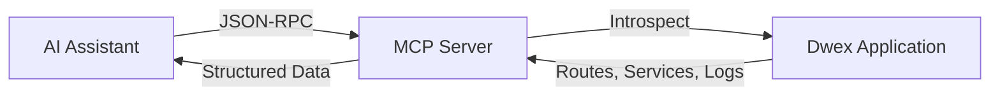

## What is MCP?

The **Model Context Protocol (MCP)** is an open standard by Anthropic that allows AI assistants like Claude to connect to external data sources and tools. For Dwex, this means your AI assistant can:

- Understand your application's structure in real-time
- Debug issues by inspecting routes, services, and dependencies
- Answer questions about your codebase without manual searching
- Monitor application health and performance

Think of it as giving your AI assistant "x-ray vision" into your running application.

## How It Works



1. Your Dwex application exposes an MCP endpoint (default: `/mcp`)
2. AI assistants connect to this endpoint via HTTP
3. The AI can call tools to inspect your application
4. You get instant answers about your codebase

## Setting Up MCP Server

### 1. Install the AI Module

```bash
bun add @dwex/ai
```

### 2. Configure Your Application

Add MCP support to your main application file:

```typescript title="src/main.ts"
import "reflect-metadata";
import { DwexFactory } from "@dwex/core";
import { AiModule } from "@dwex/ai";
import { AppModule } from "./app.module";

const app = await DwexFactory.create(AppModule);

// Setup MCP server
AiModule.setup(app, {
  path: "/mcp",              // Endpoint path
  enableAuth: false,         // Disable auth for local development
  logBufferSize: 1000,       // Keep last 1000 logs in memory
  enabled: true,             // Enable MCP
});

await app.listen(3000);
```

### 3. Start Your Application

```bash
bun run src/main.ts
```

Your MCP server is now running at `http://localhost:3000/mcp`

## Connecting AI Assistants

### Claude Desktop

Add to your Claude Desktop configuration file:

**macOS**: `~/Library/Application Support/Claude/claude_desktop_config.json`
**Windows**: `%APPDATA%\Claude\claude_desktop_config.json`

```json
{
  "mcpServers": {
    "dwex-app": {
      "url": "http://localhost:3000/mcp"
    }
  }
}
```

Restart Claude Desktop. You'll see a 🔌 icon indicating MCP is connected.

### With Authentication

For production or shared environments:

```typescript
AiModule.setup(app, {
  path: "/mcp",
  enableAuth: true,
  apiKey: process.env.MCP_API_KEY,
});
```

Configure Claude Desktop:

```json
{
  "mcpServers": {
    "dwex-app": {
      "url": "http://localhost:3000/mcp",
      "headers": {
        "x-api-key": "your-secret-api-key"
      }
    }
  }
}
```

### Remote Servers

Connect to a remote Dwex application:

```json
{
  "mcpServers": {
    "dwex-staging": {
      "url": "https://staging.example.com/mcp",
      "headers": {
        "x-api-key": "staging-api-key"
      }
    },
    "dwex-production": {
      "url": "https://api.example.com/mcp",
      "headers": {
        "x-api-key": "production-api-key"
      }
    }
  }
}
```

## Available MCP Tools

The AI assistant has access to 7 powerful introspection tools:

### 1. list_routes

Lists all registered routes in your application.

**AI Example**:
```
You: "What routes are available in this app?"
AI: *Uses list_routes tool*
AI: "Your application has 15 routes:
     - GET /api/users
     - POST /api/users
     - GET /api/users/:id
     ..."
```

**Returns**:
```json
{
  "routes": [
    {
      "path": "/api/users",
      "method": "GET",
      "controller": "UserController",
      "handler": "findAll"
    }
  ],
  "count": 15
}
```

### 2. get_route_details

Get detailed information about a specific route including guards, interceptors, and parameters.

**AI Example**:
```
You: "What guards are on the POST /api/users route?"
AI: *Uses get_route_details with path="/api/users" and method="POST"*
AI: "The POST /api/users route has:
     - Guards: AuthGuard, RoleGuard
     - Interceptors: LoggingInterceptor
     - Parameters: body contains CreateUserDto"
```

**Input**:
```typescript
{
  path: "/api/users",
  method: "POST"
}
```

**Returns**:
```json
{
  "route": {
    "path": "/api/users",
    "method": "POST",
    "controller": "UserController",
    "handler": "create",
    "guards": ["AuthGuard", "RoleGuard"],
    "interceptors": ["LoggingInterceptor"],
    "params": [
      {
        "name": "body",
        "type": "CreateUserDto",
        "index": 0
      }
    ],
    "metadata": {}
  }
}
```

### 3. list_services

Lists all services registered in the DI container.

**AI Example**:
```
You: "What services are available?"
AI: *Uses list_services tool*
AI: "You have 23 services registered:
     - UserService
     - AuthService
     - DatabaseService
     ..."
```

**Returns**:
```json
{
  "services": [
    {
      "name": "UserService",
      "scope": "SINGLETON"
    },
    {
      "name": "AuthService",
      "scope": "SINGLETON"
    }
  ],
  "count": 23
}
```

### 4. get_service_details

Get detailed information about a service including its dependencies.

**AI Example**:
```
You: "What does UserService depend on?"
AI: *Uses get_service_details with serviceName="UserService"*
AI: "UserService depends on:
     - DatabaseService (for data access)
     - LoggerService (for logging)
     - AuthService (for authentication)"
```

**Input**:
```typescript
{
  serviceName: "UserService"
}
```

**Returns**:
```json
{
  "service": {
    "name": "UserService",
    "scope": "SINGLETON",
    "dependencies": ["DatabaseService", "LoggerService", "AuthService"]
  }
}
```

### 5. list_middlewares

Lists all global and controller-scoped middlewares.

**AI Example**:
```
You: "What middlewares are running?"
AI: *Uses list_middlewares tool*
AI: "Global middlewares:
     1. corsMiddleware
     2. bodyParserMiddleware
     3. loggingMiddleware"
```

**Returns**:
```json
{
  "global": [
    "corsMiddleware",
    "bodyParserMiddleware"
  ],
  "controllers": {
    "UserController": ["authMiddleware"],
    "AdminController": ["authMiddleware", "adminMiddleware"]
  }
}
```

### 6. get_dependency_graph

Get the complete dependency graph showing relationships between all services.

**AI Example**:
```
You: "Which services depend on DatabaseService?"
AI: *Uses get_dependency_graph tool*
AI: "3 services depend on DatabaseService:
     - UserService
     - OrderService
     - ProductService

     Here's the full dependency tree..."
```

**Returns**:
```json
{
  "nodes": [
    {
      "id": "UserService",
      "name": "UserService",
      "dependencies": ["DatabaseService", "LoggerService"]
    }
  ],
  "edges": [
    {
      "from": "UserService",
      "to": "DatabaseService"
    }
  ]
}
```

### 7. get_logs

Retrieve recent application logs with optional filtering.

**AI Example**:
```
You: "Show me error logs from the last 5 minutes"
AI: *Uses get_logs with level="error" and limit=50*
AI: "Found 3 errors in the last 5 minutes:
     1. [UserService] Database connection timeout
     2. [AuthService] Invalid JWT token
     3. [OrderService] Payment gateway unreachable"
```

**Input**:
```typescript
{
  level?: "log" | "error" | "warn" | "debug" | "verbose",
  limit?: number,  // default: 100
  context?: string // filter by logger context
}
```

**Returns**:
```json
{
  "logs": [
    {
      "timestamp": "2024-01-15T10:30:45.123Z",
      "level": "error",
      "message": "Database connection timeout",
      "context": "UserService"
    }
  ],
  "count": 3,
  "total": 150
}
```

## Available Resources

MCP resources provide read-only access to application data:

### 1. routes://all

Get all routes as a resource.

**URI**: `routes://all`

### 2. services://all

Get all services as a resource.

**URI**: `services://all`

### 3. logs://recent

Get recent logs as a resource.

**URI**: `logs://recent?limit=100&level=error`

### 4. dependency-graph://all

Get the full dependency graph.

**URI**: `dependency-graph://all`

## Real-World Usage Examples

### Debugging a 500 Error

```
You: "The /api/orders endpoint is returning 500 errors"

AI: Let me investigate...
    *Uses get_route_details for /api/orders*
    *Uses get_service_details for OrderService*
    *Uses get_logs with level="error"*

AI: "I found the issue:
     1. OrderService depends on PaymentService
     2. Recent logs show 'PaymentService: Connection refused to payment.example.com'
     3. The payment gateway is unreachable

     Suggested fix: Check payment gateway status or add retry logic"
```

### Understanding Service Dependencies

```
You: "Can I safely refactor PaymentService?"

AI: Let me check dependencies...
    *Uses get_dependency_graph*

AI: "PaymentService is used by:
     - OrderService
     - SubscriptionService
     - RefundService

     You'll need to:
     1. Update all 3 dependent services
     2. Run tests for OrderController and SubscriptionController
     3. Check if any guards or interceptors use PaymentService"
```

### Monitoring Performance

```
You: "The app feels slow"

AI: Let me analyze...
    *Uses get_logs with context="DatabaseService"*

AI: "I see 127 slow query warnings in the last 10 minutes:

     Slowest queries:
     1. UserService.findAll - avg 2.3s (missing index on email)
     2. OrderService.getHistory - avg 1.8s (N+1 query problem)

     Recommendations:
     - Add index on users.email
     - Use eager loading for order.items relationship"
```

### Onboarding New Developers

```
Developer: "How does authentication work in this app?"

AI: Let me show you...
    *Uses list_routes to find auth routes*
    *Uses get_route_details for /api/auth/login*
    *Uses get_service_details for AuthService*

AI: "Authentication flow:
     1. POST /api/auth/login (AuthController.login)
     2. Uses AuthService which depends on:
        - JwtService (for token generation)
        - UserService (for user lookup)
        - BcryptService (for password verification)
     3. Protected routes use AuthGuard
     4. JwtStrategy validates tokens

     Key files:
     - src/auth/auth.service.ts
     - src/auth/guards/auth.guard.ts
     - src/auth/strategies/jwt.strategy.ts"
```

## Configuration Reference

```typescript
interface AiModuleConfig {
  // MCP endpoint path (default: "/mcp")
  path?: string;

  // Enable API key authentication (default: false)
  enableAuth?: boolean;

  // API key for authentication (required if enableAuth is true)
  apiKey?: string;

  // Number of logs to keep in circular buffer (default: 1000)
  logBufferSize?: number;

  // Enable or disable MCP server entirely (default: true)
  enabled?: boolean;
}
```

### Environment-Based Configuration

```typescript
const mcpConfig = {
  development: {
    path: "/mcp",
    enableAuth: false,
    logBufferSize: 1000,
    enabled: true,
  },
  staging: {
    path: "/mcp",
    enableAuth: true,
    apiKey: process.env.MCP_API_KEY,
    logBufferSize: 5000,
    enabled: true,
  },
  production: {
    enabled: false, // Disable in production for security
  },
};

AiModule.setup(app, mcpConfig[process.env.NODE_ENV || "development"]);
```

## Security Considerations

### 1. Always Use Authentication in Non-Local Environments

```typescript
AiModule.setup(app, {
  enableAuth: process.env.NODE_ENV !== "development",
  apiKey: process.env.MCP_API_KEY,
});
```

### 2. Disable in Production

```typescript
AiModule.setup(app, {
  enabled: process.env.NODE_ENV === "development",
});
```

### 3. Use Strong API Keys

```bash
# Generate a strong API key
openssl rand -base64 32

# Set in environment
export MCP_API_KEY="your-generated-key"
```

### 4. Network Isolation

- Only expose MCP endpoint to trusted networks
- Use firewall rules to restrict access
- Consider using VPN or SSH tunneling for remote access

### 5. Log Sanitization

Ensure sensitive data is not logged:

```typescript
import { Logger } from "@dwex/logger";

const logger = new Logger("PaymentService");

// Bad - logs sensitive data
logger.log(`Processing payment for card ${cardNumber}`);

// Good - sanitizes sensitive data
logger.log(`Processing payment for card ending in ${cardNumber.slice(-4)}`);
```

## Troubleshooting

### MCP Server Not Responding

**Check server is running**:
```bash
curl -X POST http://localhost:3000/mcp \
  -H "Content-Type: application/json" \
  -d '{"jsonrpc":"2.0","method":"tools/list","id":1}'
```

**Expected response**:
```json
{
  "jsonrpc": "2.0",
  "result": {
    "tools": [
      {"name": "list_routes", "description": "..."},
      ...
    ]
  },
  "id": 1
}
```

### Claude Desktop Can't Connect

1. **Verify MCP server is running**: Check your application logs
2. **Check configuration path**: Ensure `claude_desktop_config.json` is in the correct location
3. **Restart Claude Desktop**: Changes require a restart
4. **Check for port conflicts**: Ensure port 3000 (or your configured port) is available
5. **Verify JSON syntax**: Invalid JSON in config file will prevent connection

### Authentication Errors

```json
{
  "jsonrpc": "2.0",
  "error": {
    "code": -32600,
    "message": "Unauthorized: Invalid or missing API key"
  }
}
```

**Solutions**:
- Verify API key matches between server and client config
- Check header name is `x-api-key` or `authorization`
- Ensure `enableAuth: true` in server config

### No Logs Appearing

MCP can only show logs from `@dwex/logger`:

```typescript
// This will NOT appear in MCP
console.log("User created");

// This WILL appear in MCP
import { Logger } from "@dwex/logger";
const logger = new Logger("UserService");
logger.log("User created");
```

### Tool Execution Errors

Check AI assistant's error messages:
- **"Tool not found"**: Tool name mismatch, use exact names (e.g., `list_routes`)
- **"Invalid parameters"**: Check input schema requirements
- **"Timeout"**: Application may be unresponsive, check server logs

## Advanced Usage

### Custom Log Buffer Size

For high-traffic applications:

```typescript
AiModule.setup(app, {
  logBufferSize: 10000, // Keep last 10,000 logs
});
```

### Multiple MCP Servers

Connect to multiple environments:

```json
{
  "mcpServers": {
    "local": {
      "url": "http://localhost:3000/mcp"
    },
    "staging": {
      "url": "https://staging.example.com/mcp",
      "headers": {
        "x-api-key": "staging-key"
      }
    }
  }
}
```

Ask Claude: "Check the staging environment's routes"

### Custom Endpoint Path

```typescript
AiModule.setup(app, {
  path: "/api/introspection", // Custom path
});
```

Update Claude config:
```json
{
  "mcpServers": {
    "dwex-app": {
      "url": "http://localhost:3000/api/introspection"
    }
  }
}
```

## Best Practices

1. **Keep MCP disabled in production** unless absolutely necessary
2. **Always use authentication** for non-local environments
3. **Use environment variables** for API keys
4. **Monitor MCP access** through application logs
5. **Limit log buffer size** based on memory constraints
6. **Use strong API keys** (minimum 32 characters)
7. **Restrict network access** to MCP endpoint
8. **Regularly rotate API keys** in production environments
9. **Use `@dwex/logger`** for all logging to ensure MCP visibility
10. **Document your MCP setup** in team onboarding materials

## Next Steps

<Cards>
  <Card title="AI Module Overview" href="/docs/ai" />
  <Card title="Logger Module" href="/docs/techniques/logger" />
  <Card title="Dependency Injection" href="/docs/fundamentals/dependency-injection" />
</Cards>
