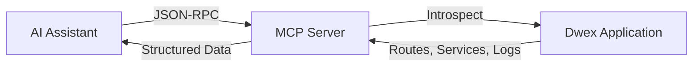

## What is MCP?

The **Model Context Protocol (MCP)** is an open standard by Anthropic that enables AI assistants to connect to external tools and data sources through a standardized JSON-RPC interface.

For Dwex applications, MCP provides **real-time introspection**, allowing AI to:

- List and inspect routes, controllers, and handlers
- View service dependencies and dependency graphs
- Analyze middleware chains and guards
- Read application logs for debugging
- Monitor your application structure as it evolves

Think of it as giving your AI assistant "x-ray vision" into your running application—enabling instant answers, debugging, and codebase understanding without manually reading files.

## How It Works



1. Your Dwex application exposes an MCP endpoint (default: `/mcp`)
2. AI assistants connect to this endpoint via HTTP
3. The AI can call tools to inspect your application
4. You get instant answers about your codebase

## Setting Up MCP Server

### 1. Install the AI Module

```bash
bun add @dwex/ai
```

### 2. Configure Your Application

Add MCP support to your main application file:

```typescript title="src/main.ts"
import "reflect-metadata";
import { DwexFactory } from "@dwex/core";
import { AiModule } from "@dwex/ai";
import { AppModule } from "./app.module";

const app = await DwexFactory.create(AppModule);

// Setup MCP server with builder pattern
new AiModule()
  .setPath("/mcp")
  .setLogBufferSize(1000)
  .setup(app);

await app.listen(3000);
```

### 3. Start Your Application

```bash
bun run src/main.ts
```

Your MCP server is now running at `http://localhost:3000/mcp`

## Connecting AI Assistants

### Claude Desktop

Add to your Claude Desktop configuration file:

**macOS**: `~/Library/Application Support/Claude/claude_desktop_config.json`
**Windows**: `%APPDATA%\Claude\claude_desktop_config.json`

```json
{
  "mcpServers": {
    "dwex-app": {
      "url": "http://localhost:3000/mcp"
    }
  }
}
```

Restart Claude Desktop. You'll see a 🔌 icon indicating MCP is connected.

### With Authentication

For production or shared environments:

```typescript
new AiModule()
  .setPath("/mcp")
  .enableAuth(process.env.MCP_API_KEY)
  .setup(app);
```

Configure Claude Desktop:

```json
{
  "mcpServers": {
    "dwex-app": {
      "url": "http://localhost:3000/mcp",
      "headers": {
        "x-api-key": "your-secret-api-key"
      }
    }
  }
}
```

### Remote Servers

Connect to a remote Dwex application:

```json
{
  "mcpServers": {
    "dwex-staging": {
      "url": "https://staging.example.com/mcp",
      "headers": {
        "x-api-key": "staging-api-key"
      }
    },
    "dwex-production": {
      "url": "https://api.example.com/mcp",
      "headers": {
        "x-api-key": "production-api-key"
      }
    }
  }
}
```

## Available MCP Tools

The AI assistant has access to 7 powerful introspection tools:

### 1. list_routes

Lists all registered routes in your application.

**AI Example**:
```
You: "What routes are available in this app?"
AI: *Uses list_routes tool*
AI: "Your application has 15 routes:
     - GET /api/users
     - POST /api/users
     - GET /api/users/:id
     ..."
```

**Returns**:
```json
{
  "routes": [
    {
      "path": "/api/users",
      "method": "GET",
      "controller": "UserController",
      "handler": "findAll"
    }
  ],
  "count": 15
}
```

### 2. get_route_details

Get detailed information about a specific route including guards, interceptors, and parameters.

**AI Example**:
```
You: "What guards are on the POST /api/users route?"
AI: *Uses get_route_details with path="/api/users" and method="POST"*
AI: "The POST /api/users route has:
     - Guards: AuthGuard, RoleGuard
     - Interceptors: LoggingInterceptor
     - Parameters: body contains CreateUserDto"
```

**Input**:
```typescript
{
  path: "/api/users",
  method: "POST"
}
```

**Returns**:
```json
{
  "route": {
    "path": "/api/users",
    "method": "POST",
    "controller": "UserController",
    "handler": "create",
    "guards": ["AuthGuard", "RoleGuard"],
    "interceptors": ["LoggingInterceptor"],
    "params": [
      {
        "name": "body",
        "type": "CreateUserDto",
        "index": 0
      }
    ],
    "metadata": {}
  }
}
```

### 3. list_services

Lists all services registered in the DI container.

**AI Example**:
```
You: "What services are available?"
AI: *Uses list_services tool*
AI: "You have 23 services registered:
     - UserService
     - AuthService
     - DatabaseService
     ..."
```

**Returns**:
```json
{
  "services": [
    {
      "name": "UserService",
      "scope": "SINGLETON"
    },
    {
      "name": "AuthService",
      "scope": "SINGLETON"
    }
  ],
  "count": 23
}
```

### 4. get_service_details

Get detailed information about a service including its dependencies.

**AI Example**:
```
You: "What does UserService depend on?"
AI: *Uses get_service_details with serviceName="UserService"*
AI: "UserService depends on:
     - DatabaseService (for data access)
     - LoggerService (for logging)
     - AuthService (for authentication)"
```

**Input**:
```typescript
{
  serviceName: "UserService"
}
```

**Returns**:
```json
{
  "service": {
    "name": "UserService",
    "scope": "SINGLETON",
    "dependencies": ["DatabaseService", "LoggerService", "AuthService"]
  }
}
```

### 5. list_middlewares

Lists all global and controller-scoped middlewares.

**AI Example**:
```
You: "What middlewares are running?"
AI: *Uses list_middlewares tool*
AI: "Global middlewares:
     1. corsMiddleware
     2. bodyParserMiddleware
     3. loggingMiddleware"
```

**Returns**:
```json
{
  "global": [
    "corsMiddleware",
    "bodyParserMiddleware"
  ],
  "controllers": {
    "UserController": ["authMiddleware"],
    "AdminController": ["authMiddleware", "adminMiddleware"]
  }
}
```

### 6. get_dependency_graph

Get the complete dependency graph showing relationships between all services.

**AI Example**:
```
You: "Which services depend on DatabaseService?"
AI: *Uses get_dependency_graph tool*
AI: "3 services depend on DatabaseService:
     - UserService
     - OrderService
     - ProductService

     Here's the full dependency tree..."
```

**Returns**:
```json
{
  "nodes": [
    {
      "id": "UserService",
      "name": "UserService",
      "dependencies": ["DatabaseService", "LoggerService"]
    }
  ],
  "edges": [
    {
      "from": "UserService",
      "to": "DatabaseService"
    }
  ]
}
```

### 7. get_logs

Retrieve recent application logs with optional filtering.

**AI Example**:
```
You: "Show me error logs from the last 5 minutes"
AI: *Uses get_logs with level="error" and limit=50*
AI: "Found 3 errors in the last 5 minutes:
     1. [UserService] Database connection timeout
     2. [AuthService] Invalid JWT token
     3. [OrderService] Payment gateway unreachable"
```

**Input**:
```typescript
{
  level?: "log" | "error" | "warn" | "debug" | "verbose",
  limit?: number,  // default: 100
  context?: string // filter by logger context
}
```

**Returns**:
```json
{
  "logs": [
    {
      "timestamp": "2024-01-15T10:30:45.123Z",
      "level": "error",
      "message": "Database connection timeout",
      "context": "UserService"
    }
  ],
  "count": 3,
  "total": 150
}
```

## Available Resources

MCP resources provide read-only access to application data:

### 1. routes://all

Get all routes as a resource.

**URI**: `routes://all`

### 2. services://all

Get all services as a resource.

**URI**: `services://all`

### 3. logs://recent

Get recent logs as a resource.

**URI**: `logs://recent?limit=100&level=error`

### 4. dependency-graph://all

Get the full dependency graph.

**URI**: `dependency-graph://all`

## Real-World Scenarios

### Scenario 1: Debugging Production Errors

**Problem:** `/api/orders` endpoint returning 500 errors in production.

```
You: "The /api/orders endpoint is returning 500 errors"

AI: Let me investigate...
    *Uses list_routes to find the route*
    *Uses get_route_details for /api/orders*
    *Uses get_service_details for OrderService*
    *Uses get_logs with level="error"*

AI: "Found the issue:

     Route: GET /api/orders
     Handler: OrderController.findAll
     Dependencies: OrderService → PaymentService → HttpClient

     Error logs (last 5 min):
     - [PaymentService] Connection refused to payment.example.com
     - [PaymentService] Retry failed after 3 attempts
     - [OrderController] Unhandled error: ECONNREFUSED

     Root cause: Payment gateway is unreachable. Orders service
     is failing because it tries to fetch payment status during
     order retrieval.

     Suggested fixes:
     1. Add fallback logic for payment service timeouts
     2. Implement circuit breaker pattern
     3. Cache payment status to reduce external calls
     4. Add better error handling in OrderService"
```

**Time saved:** 30 minutes of log searching and code tracing → 30 seconds with MCP.

### Scenario 2: Safe Refactoring

**Problem:** Need to refactor `PaymentService` without breaking dependent code.

```
You: "I want to refactor PaymentService to use Stripe instead of PayPal.
     Show me what depends on it."

AI: Analyzing dependencies...
    *Uses get_dependency_graph*
    *Uses list_services*
    *Uses grep to find PaymentService usage*

AI: "PaymentService dependency analysis:

     Direct dependents (3 services):
     - OrderService (for payment processing)
     - SubscriptionService (for recurring billing)
     - RefundService (for refund handling)

     Affected controllers (2):
     - OrderController (POST /api/orders, GET /api/orders/:id/payment)
     - SubscriptionController (POST /api/subscriptions)

     Guards using PaymentService:
     - PaymentVerificationGuard (used in AdminController)

     Recommendations:
     1. Create PaymentProviderInterface first
     2. Update PaymentService to implement interface
     3. Update 3 dependent services to use interface
     4. Run integration tests for OrderController & SubscriptionController
     5. Test PaymentVerificationGuard with new implementation

     Files to update:
     - src/modules/payment/payment.service.ts
     - src/modules/orders/order.service.ts
     - src/modules/subscriptions/subscription.service.ts
     - src/modules/refunds/refund.service.ts
     - src/guards/payment-verification.guard.ts"
```

**Time saved:** 2 hours of manual dependency tracking → 1 minute with MCP.

### Scenario 3: Performance Optimization

**Problem:** Application experiencing slowdowns under load.

```
You: "The API is slow. Identify performance bottlenecks."

AI: Analyzing performance...
    *Uses get_logs with context filters*
    *Uses list_routes to identify slow endpoints*
    *Uses get_service_details for database services*

AI: "Performance analysis (last 10 minutes):

     Slow query warnings: 127 occurrences

     Top 3 bottlenecks:
     1. UserService.findAll
        - Avg response time: 2.3s
        - Issue: Full table scan, missing index on email field
        - Location: src/modules/users/user.service.ts:45

     2. OrderService.getHistory
        - Avg response time: 1.8s
        - Issue: N+1 query problem loading order items
        - Location: src/modules/orders/order.service.ts:78

     3. ProductService.search
        - Avg response time: 1.2s
        - Issue: No full-text search index
        - Location: src/modules/products/product.service.ts:92

     Recommended fixes:
     1. Add database index:
        CREATE INDEX idx_users_email ON users(email);

     2. Use eager loading in OrderService:
        this.db.order.findMany({ include: { items: true } })

     3. Implement Elasticsearch for product search

     4. Add caching layer for frequently accessed data"
```

**Time saved:** Hours of profiling → Minutes with MCP.

### Scenario 4: Onboarding New Developers

**Problem:** New team member needs to understand authentication system.

```
Developer: "How does authentication work in this app?"

AI: Let me map out the authentication flow...
    *Uses list_routes to find auth endpoints*
    *Uses get_route_details for each auth route*
    *Uses get_service_details for AuthService*
    *Uses get_dependency_graph to show auth-related dependencies*

AI: "Authentication System Overview:

     Endpoints:
     - POST /api/auth/register (public)
     - POST /api/auth/login (public)
     - POST /api/auth/refresh (requires refresh token)
     - POST /api/auth/logout (requires auth)
     - GET /api/auth/me (requires auth)

     Flow:
     1. User registers via POST /api/auth/register
        → AuthController.register
        → AuthService.register
        → Creates user in database
        → Returns access + refresh tokens

     2. User logs in via POST /api/auth/login
        → AuthController.login
        → AuthService.validateUser
        → BcryptService.compare (password verification)
        → JwtService.sign (generate tokens)

     3. Protected routes use AuthGuard
        → Extracts JWT from Authorization header
        → JwtStrategy.validate verifies token
        → Attaches user to request object

     Dependencies:
     AuthService depends on:
     - UserService (user lookup)
     - JwtService (token generation/validation)
     - BcryptService (password hashing)

     Guards:
     - AuthGuard (routes requiring login)
     - RoleGuard (routes requiring specific roles)

     Key files:
     - src/modules/auth/auth.module.ts (module registration)
     - src/modules/auth/auth.service.ts (business logic)
     - src/modules/auth/auth.controller.ts (HTTP handlers)
     - src/modules/auth/guards/auth.guard.ts (JWT verification)
     - src/modules/auth/guards/role.guard.ts (role checking)
     - src/modules/auth/strategies/jwt.strategy.ts (token strategy)

     Environment variables needed:
     - JWT_SECRET (for signing tokens)
     - JWT_EXPIRES_IN (token expiration, e.g., '15m')
     - JWT_REFRESH_EXPIRES_IN (refresh token expiration, e.g., '7d')"
```

**Time saved:** Hours of code reading → 2 minutes with MCP.

### Scenario 5: API Documentation Discovery

**Problem:** Need to understand available API endpoints for frontend integration.

```
Developer: "What API endpoints are available for user management?"

AI: Listing user-related endpoints...
    *Uses list_routes with filter*
    *Uses get_route_details for each route*

AI: "User Management API:

     GET /api/users
     - Handler: UserController.findAll
     - Guards: AuthGuard, AdminGuard
     - Query params: page, limit, search, role
     - Returns: Paginated list of users
     - Required role: admin

     GET /api/users/:id
     - Handler: UserController.findOne
     - Guards: AuthGuard
     - Params: id (user UUID)
     - Returns: User object
     - Access: Own profile or admin

     POST /api/users
     - Handler: UserController.create
     - Guards: AuthGuard, AdminGuard
     - Body: CreateUserDto (email, name, password, role)
     - Validation: Email format, min password length 8
     - Returns: Created user object
     - Required role: admin

     PUT /api/users/:id
     - Handler: UserController.update
     - Guards: AuthGuard
     - Params: id (user UUID)
     - Body: UpdateUserDto (name, email, avatar)
     - Returns: Updated user object
     - Access: Own profile or admin

     DELETE /api/users/:id
     - Handler: UserController.remove
     - Guards: AuthGuard, AdminGuard
     - Params: id (user UUID)
     - Returns: Success message
     - Required role: admin

     PATCH /api/users/:id/password
     - Handler: UserController.changePassword
     - Guards: AuthGuard
     - Params: id (user UUID)
     - Body: { oldPassword, newPassword }
     - Returns: Success message
     - Access: Own profile only"
```

**Time saved:** Reading docs or source code → Instant API discovery.

### Scenario 6: Circular Dependency Detection

**Problem:** Application fails to start with dependency injection error.

```
You: "App won't start. Error: 'Cannot resolve dependencies'"

AI: Analyzing dependency graph...
    *Uses get_dependency_graph*
    *Detects circular references*

AI: "Circular dependency detected:

     OrderService → UserService → NotificationService → OrderService

     Breakdown:
     1. OrderService injects UserService (to get user details)
     2. UserService injects NotificationService (to notify users)
     3. NotificationService injects OrderService (to send order updates)

     This creates a circular dependency loop that prevents
     the DI container from instantiating these services.

     Solutions:
     1. Use Event Emitter pattern:
        OrderService emits 'order.created' event
        NotificationService listens to event
        Removes direct dependency

     2. Extract shared logic to OrderNotificationService:
        NotificationService → OrderNotificationService
        OrderService → OrderNotificationService
        UserService → NotificationService (not OrderNotificationService)

     3. Use forwardRef (not recommended):
        @Inject(forwardRef(() => OrderService))

     Recommended: Solution #1 (Event Emitter)"
```

**Time saved:** Hours of debugging → Minutes with MCP.

## MCP Tools Reference

Dwex MCP server provides 7 tools for application introspection:

| Tool | Purpose | Common Use Cases |
|------|---------|------------------|
| `list_routes` | List all registered routes | API discovery, documentation, finding endpoints |
| `get_route_details` | Get route metadata (guards, interceptors, params) | Debugging specific endpoints, understanding middleware |
| `list_services` | List all DI container services | Understanding app structure, service discovery |
| `get_service_details` | Get service dependencies | Debugging injection issues, refactoring prep |
| `list_middlewares` | List global and controller middlewares | Understanding request pipeline, debugging middleware |
| `get_dependency_graph` | Get complete dependency graph | Refactoring, circular dependency detection, impact analysis |
| `get_logs` | Retrieve recent application logs | Debugging errors, performance monitoring, auditing |

### Tool Examples

<Tabs>
<Tab value="list_routes" label="list_routes">

**Lists all HTTP routes in your application.**

**Usage:**
```typescript
// AI calls this via MCP
{
  tool: "list_routes"
}
```

**Returns:**
```json
{
  "routes": [
    {
      "path": "/api/users",
      "method": "GET",
      "controller": "UserController",
      "handler": "findAll"
    },
    {
      "path": "/api/users/:id",
      "method": "GET",
      "controller": "UserController",
      "handler": "findOne"
    }
  ],
  "count": 15
}
```

**Ask AI:**
- "What routes are available?"
- "List all POST endpoints"
- "Show me admin routes"

</Tab>

<Tab value="get_route_details" label="get_route_details">

**Get detailed information about a specific route.**

**Usage:**
```typescript
// AI calls this via MCP
{
  tool: "get_route_details",
  path: "/api/users/:id",
  method: "GET"
}
```

**Returns:**
```json
{
  "route": {
    "path": "/api/users/:id",
    "method": "GET",
    "controller": "UserController",
    "handler": "findOne",
    "guards": ["AuthGuard"],
    "interceptors": ["LoggingInterceptor"],
    "params": [
      { "name": "id", "type": "string", "index": 0 }
    ]
  }
}
```

**Ask AI:**
- "What guards protect /api/users/:id?"
- "Show me the interceptors on POST /api/orders"
- "What parameters does /api/search accept?"

</Tab>

<Tab value="get_dependency_graph" label="get_dependency_graph">

**Get the complete service dependency graph.**

**Usage:**
```typescript
// AI calls this via MCP
{
  tool: "get_dependency_graph"
}
```

**Returns:**
```json
{
  "nodes": [
    {
      "id": "UserService",
      "name": "UserService",
      "dependencies": ["DatabaseService", "LoggerService"]
    },
    {
      "id": "OrderService",
      "name": "OrderService",
      "dependencies": ["UserService", "PaymentService"]
    }
  ],
  "edges": [
    { "from": "UserService", "to": "DatabaseService" },
    { "from": "UserService", "to": "LoggerService" },
    { "from": "OrderService", "to": "UserService" },
    { "from": "OrderService", "to": "PaymentService" }
  ]
}
```

**Ask AI:**
- "What depends on DatabaseService?"
- "Show me the dependency tree for OrderService"
- "Are there any circular dependencies?"

</Tab>

<Tab value="get_logs" label="get_logs">

**Retrieve recent application logs with filtering.**

**Usage:**
```typescript
// AI calls this via MCP
{
  tool: "get_logs",
  level: "error",
  limit: 50,
  context: "UserService"
}
```

**Returns:**
```json
{
  "logs": [
    {
      "timestamp": "2024-01-15T10:30:45.123Z",
      "level": "error",
      "message": "Failed to fetch user",
      "context": "UserService"
    }
  ],
  "count": 3,
  "total": 1000
}
```

**Ask AI:**
- "Show me error logs from the last 5 minutes"
- "What warnings has DatabaseService logged?"
- "Find logs related to authentication failures"

</Tab>
</Tabs>

## MCP Resources Reference

MCP resources provide read-only access to application data via URIs:

| Resource URI | Data Provided | Use Case |
|--------------|---------------|----------|
| `routes://all` | All routes as structured data | Generating API docs, route analysis |
| `services://all` | All services and their scopes | Service inventory, architecture overview |
| `logs://recent?limit=100&level=error` | Recent logs with filters | Log aggregation, error monitoring |
| `dependency-graph://all` | Complete dependency graph | Architecture visualization, refactoring |

### Resource Examples

<Accordions type="single">
<Accordion title="routes://all">

Returns all application routes as a structured resource.

**URI:** `routes://all`

**Example:**
```
AI reads resource: routes://all
```

**Returns:** Same format as `list_routes` tool but as a resource that can be cached and referenced.

</Accordion>

<Accordion title="services://all">

Returns all services registered in the DI container.

**URI:** `services://all`

**Example:**
```
AI reads resource: services://all
```

**Returns:** Same format as `list_services` tool.

</Accordion>

<Accordion title="logs://recent">

Returns recent logs with optional query parameters.

**URI:** `logs://recent?limit=100&level=error`

**Query Parameters:**
- `limit` - Number of logs to return (default: 100)
- `level` - Filter by log level (log, error, warn, debug, verbose)
- `context` - Filter by logger context

**Example:**
```
AI reads resource: logs://recent?limit=50&level=error
```

</Accordion>

<Accordion title="dependency-graph://all">

Returns the complete dependency graph.

**URI:** `dependency-graph://all`

**Example:**
```
AI reads resource: dependency-graph://all
```

**Returns:** Same format as `get_dependency_graph` tool.

</Accordion>
</Accordions>

## Configuration Reference

```typescript
interface AiModuleConfig {
  // MCP endpoint path (default: "/mcp")
  path?: string;

  // Enable API key authentication (default: false)
  enableAuth?: boolean;

  // API key for authentication (required if enableAuth is true)
  apiKey?: string;

  // Number of logs to keep in circular buffer (default: 1000)
  logBufferSize?: number;

  // Enable or disable MCP server entirely (default: true)
  enabled?: boolean;
}
```

### Environment-Based Configuration

```typescript
const mcpConfig = {
  development: {
    path: "/mcp",
    enableAuth: false,
    logBufferSize: 1000,
    enabled: true,
  },
  staging: {
    path: "/mcp",
    enableAuth: true,
    apiKey: process.env.MCP_API_KEY,
    logBufferSize: 5000,
    enabled: true,
  },
  production: {
    enabled: false, // Disable in production for security
  },
};

AiModule.setup(app, mcpConfig[process.env.NODE_ENV || "development"]);
```

## Security Considerations

### 1. Always Use Authentication in Non-Local Environments

```typescript
const aiModule = new AiModule();
if (process.env.NODE_ENV !== "development") {
  aiModule.enableAuth(process.env.MCP_API_KEY);
}
aiModule.setup(app);
```

### 2. Disable in Production

```typescript
const aiModule = new AiModule();
if (process.env.NODE_ENV !== "development") {
  aiModule.disable();
}
aiModule.setup(app);
```

### 3. Use Strong API Keys

```bash
# Generate a strong API key
openssl rand -base64 32

# Set in environment
export MCP_API_KEY="your-generated-key"
```

### 4. Network Isolation

- Only expose MCP endpoint to trusted networks
- Use firewall rules to restrict access
- Consider using VPN or SSH tunneling for remote access

### 5. Log Sanitization

Ensure sensitive data is not logged:

```typescript
import { Logger } from "@dwex/logger";

const logger = new Logger("PaymentService");

// Bad - logs sensitive data
logger.log(`Processing payment for card ${cardNumber}`);

// Good - sanitizes sensitive data
logger.log(`Processing payment for card ending in ${cardNumber.slice(-4)}`);
```

## Troubleshooting

### MCP Server Not Responding

**Check server is running**:
```bash
curl -X POST http://localhost:3000/mcp \
  -H "Content-Type: application/json" \
  -d '{"jsonrpc":"2.0","method":"tools/list","id":1}'
```

**Expected response**:
```json
{
  "jsonrpc": "2.0",
  "result": {
    "tools": [
      {"name": "list_routes", "description": "..."},
      ...
    ]
  },
  "id": 1
}
```

### Claude Desktop Can't Connect

1. **Verify MCP server is running**: Check your application logs
2. **Check configuration path**: Ensure `claude_desktop_config.json` is in the correct location
3. **Restart Claude Desktop**: Changes require a restart
4. **Check for port conflicts**: Ensure port 3000 (or your configured port) is available
5. **Verify JSON syntax**: Invalid JSON in config file will prevent connection

### Authentication Errors

```json
{
  "jsonrpc": "2.0",
  "error": {
    "code": -32600,
    "message": "Unauthorized: Invalid or missing API key"
  }
}
```

**Solutions**:
- Verify API key matches between server and client config
- Check header name is `x-api-key` or `authorization`
- Ensure `enableAuth: true` in server config

### No Logs Appearing

MCP can only show logs from `@dwex/logger`:

```typescript
// This will NOT appear in MCP
console.log("User created");

// This WILL appear in MCP
import { Logger } from "@dwex/logger";
const logger = new Logger("UserService");
logger.log("User created");
```

### Tool Execution Errors

Check AI assistant's error messages:
- **"Tool not found"**: Tool name mismatch, use exact names (e.g., `list_routes`)
- **"Invalid parameters"**: Check input schema requirements
- **"Timeout"**: Application may be unresponsive, check server logs

## Advanced Usage

### Custom Log Buffer Size

For high-traffic applications:

```typescript
new AiModule()
  .setLogBufferSize(10000)
  .setup(app);
```

### Multiple MCP Servers

Connect to multiple environments:

```json
{
  "mcpServers": {
    "local": {
      "url": "http://localhost:3000/mcp"
    },
    "staging": {
      "url": "https://staging.example.com/mcp",
      "headers": {
        "x-api-key": "staging-key"
      }
    }
  }
}
```

Ask Claude: "Check the staging environment's routes"

### Custom Endpoint Path

```typescript
new AiModule()
  .setPath("/api/introspection")
  .setup(app);
```

Update Claude config:
```json
{
  "mcpServers": {
    "dwex-app": {
      "url": "http://localhost:3000/api/introspection"
    }
  }
}
```

## Best Practices

1. **Keep MCP disabled in production** unless absolutely necessary
2. **Always use authentication** for non-local environments
3. **Use environment variables** for API keys
4. **Monitor MCP access** through application logs
5. **Limit log buffer size** based on memory constraints
6. **Use strong API keys** (minimum 32 characters)
7. **Restrict network access** to MCP endpoint
8. **Regularly rotate API keys** in production environments
9. **Use `@dwex/logger`** for all logging to ensure MCP visibility
10. **Document your MCP setup** in team onboarding materials

## Next Steps

<Cards>
  <Card title="AI-First Framework" href="/docs/ai" />
  <Card title="Using AI Agents" href="/docs/using-agents" />
  <Card title="Logger Module" href="/docs/techniques/logger" />
</Cards>
